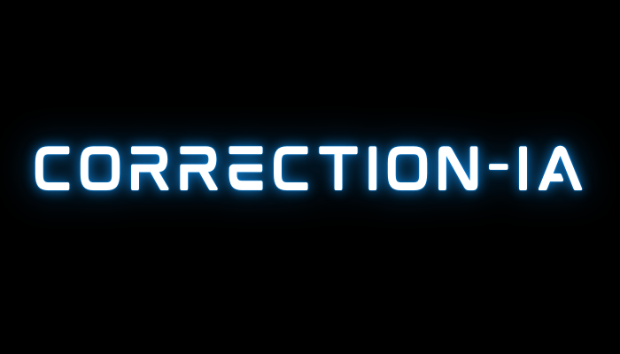

Este projeto é dedicado a impulsionar suas habilidades de escrita e garantir a nota máxima na redação do ENEM. Através de correções detalhadas e dicas personalizadas, vamos te ajudar a:
Dominar a estrutura da dissertação argumentativa.
Aprimorar sua argumentação e construir um texto coeso e coerente.
Enriquecer seu vocabulário e dominar a norma culta da língua portuguesa.
Identificar e corrigir seus erros gramaticais com precisão.
Conquistar a tão sonhada nota máxima e abrir as portas para o seu futuro!
Junte-se a nós nesta jornada de aprimoramento e conquiste o sucesso no ENEM!

<h2> Funcionalidades</h2>
<ul>
<li> 
Você escolhe o tema, escreve a sua redação, e o Correction-IA fará a 
correção dela. Colocando uma possível nota e dicas de como melhorá-la.
</li>
</ul>

<h2> Acesso ao Projeto</h2>
<ol>
<li> Clone o repositório. </li>
<li> 
Abra alguma ferramenta de edição de código (Exemplos: Pycharm e Visual Studio Code)
</li>
<li> Vá até a linha 31 e cole a sua api key no espaço correspondente. Lembre-se ela deve estar entre aspas.</li>
<li> 
Execute o arquivo main.py e bons estudos!
</li>
</ol>

<h2>Tecnologias e Técnicas</h2>

<ul>
<li>Python</li>
<li>UI com CustomTkinter</li>
<li> Integração com a IA Gemini</li>
</ul>

<h2>Autores</h2>

Felipe Vieira da Silva

<h2>Licenças</h2>
<ul>
<li>MIT License</li>
</ul>